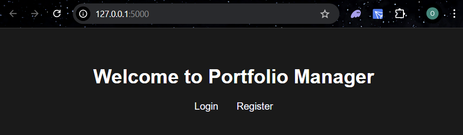
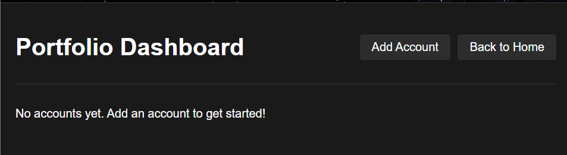
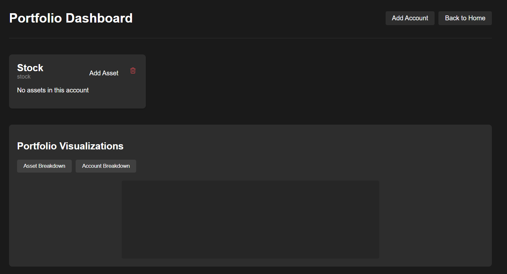
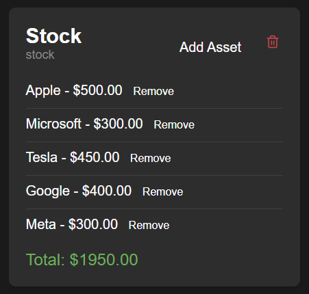
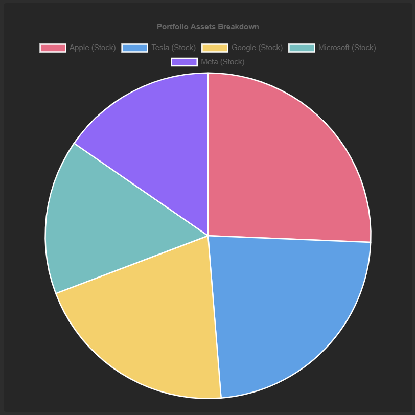

# Personal Finance Web Application

## Overview

A web application that allows users to manage their financial portfolio, including stocks, real estate, cryptocurrency, and bank accounts. The system uses OOP principles for data organization and PostgreSQL for data persistence.

## Project Structure
```
project_root/
│
├── app/
│   ├── __init__.py           # Flask application initialization
│   ├── routes/               # API endpoints
│   ├── database/             # Database management
│   ├── models/              # Model logic (accounts, assets, etc.)
│   ├── factories/           # Factory implementations (factory pattern)
│   ├── visualizations/      # Visualization strategies (strategy pattern)
│   ├── static/              # CSS files
│   └── templates/           # HTML templates
│
├── config.py               # Configuration settings
└── run.py                 # Application entry point
```

## OOP Design

Classes are organized as follows:

1. User class - Manages user authentication and portfolio interactions
2. Portfolio class - Contains and manages multiple account types
3. Account classes:

- Abstract Account base class
- StockAccount - For managing stock investments
- CryptoAccount - For managing cryptocurrency
- BankAccount - Base class for banking accounts

4. Asset classes:

- Abstract Asset base class
- Stock - Represents individual stock holdings
- Crypto - Represents cryptocurrency holdings
- Cash - Represents cash holdings

A User object owns a singular Portfolio by composition. Then, the Portfolio can be populated by User created Accounts. Once an Account is created, a User defined Asset can be added to the Account. All actions are handled by the User class.

User flow:
```
Home Page → View Portfolio → Add Account → Add Asset
                ↑_______________←______________↲
```


## Design Patterns Used

1. Factory Method Pattern - for Asset and Account creation
2. Strategy Pattern - to handle visualization stategies
3. Singleton Pattern - for database manager


## Database Schema

Uses PostgreSQL with the following structure:

- Users table - Stores user information and authentication
- Portfolios table - Links portfolios to users
- Accounts table - Stores different types of financial accounts
- Assets table - Stores assets with their respective types and values

## Current Features

1. User Authentication
2. Account Management
3. Database Integration
4. Multiple Portfolio Visualizations

## Installation and Setup

1. Clone this repository
2. Install Requirements:

        pip install -r requirements.txt

3. Setup PostgreSQL database:
    - Using pgadmin, Create DB called 'portfolio_management'
    - Navigate to servers -> databases -> portfolio_management. Right click and select 'Query Tool'
    - In the Query Tool, paste the SQL script located at app/database/db_setup.sql and execute the script. This will setup the database schema.

4. Update config file and change DB_PASSWORD to your database password

5. Run Application

        python run.py

6. To clear database, run app/database/clear_db.sql in database query tools (see step 3)

## Example Usage:

<div align="center">

### Step 1: Login or Register



### Step 2: Add Account(s) to Portfolio





### Step 3: Add Assets to Account and Visualize





</div>


## Benefits to Our System:

1. **Maintainability and Extensibility**

Our application is structured in a way making it very easy to maintain and extend. There is a clean seperation of concerns so various aspects of the project are isolated. Furthermore, the use of Factory Method and Strategy design patterns allow for very easy extension without manipulation of existing code.

2. **User Benefits:**

Our application offers intuitive user flow that allows users to easily navigate the application. Our applications offers numerous visualizations that allows for users to easily view their data. As for security, our login system can easily be extended to support robust authentication practices before deployment.

3. **Data Integrity:**

Another key benefits of the system is how application data is handled. The singleton pattern ensures consistent database connections. Furthermore, object creation is done in a way so that data is consistent across the database. For example, if an account object is deleted, all of the assets belonging to the account are deleted as well.


## Features to Add:

1. Stock/Crypto API Integration
2. Further Portfolio Visualizations
3. Additional Asset Support


## Conclusion

Our portfolio management system combines technical robustness with practical usability. Its architecture ensures easy extension while maintaining reliability and performance. The focus on clean design patterns and separation of concerns makes it both maintainable and extensible, while the user-focused interface design ensures it delivers real value to users.
